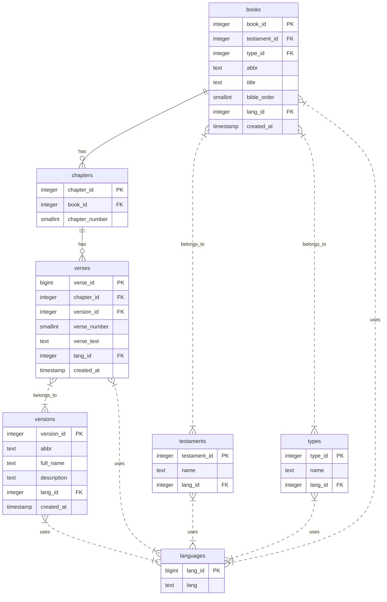

# Bible Data Schema and Retrieval Plan for kingdom-deliverance

## 1. Database Schema Overview

The Supabase "public" schema includes the following tables relevant to Bible data:

- **books**

  - book_id (PK)
  - testament_id (FK to testaments)
  - type_id (FK to types)
  - abbr (unique)
  - title
  - bible_order (unique, order in Bible)
  - lang_id (FK to languages)
  - created_at

- **chapters**

  - chapter_id (PK)
  - book_id (FK to books)
  - chapter_number (unique per book)

- **verses**

  - verse_id (PK)
  - chapter_id (FK to chapters)
  - version_id (FK to versions)
  - verse_number (unique per chapter and version)
  - verse_text
  - lang_id (FK to languages)
  - created_at

- **languages**

  - lang_id (PK)
  - lang (language name)

- **testaments**

  - testament_id (PK)
  - name
  - lang_id (FK to languages)

- **types**

  - type_id (PK)
  - name
  - lang_id (FK to languages)

- **versions**
  - version_id (PK)
  - abbr (unique)
  - full_name
  - description
  - lang_id (FK to languages)
  - created_at

## 2. Schema Creation

- Create a `schema.sql` file in the `supabase/` folder with the above table definitions.
- Use the provided SQL DDL statements to create tables with constraints and foreign keys.

## 3. Data Population

- Populate the tables with Bible data, including books, chapters, verses, languages, testaments, types, and versions.
- Use SQL `INSERT` statements or Supabase import tools.
- Start with a minimal dataset for testing.

## 4. Data Retrieval in Webapp

- Use Supabase JS client to query:
  - List of books ordered by `bible_order`.
  - Chapters for a selected book.
  - Verses for a selected chapter and version.
- Example queries:
  ```js
  const books = await supabase.from('books').select('*').order('bible_order')
  const chapters = await supabase
    .from('chapters')
    .select('*')
    .eq('book_id', bookId)
    .order('chapter_number')
  const verses = await supabase
    .from('verses')
    .select('*')
    .eq('chapter_id', chapterId)
    .eq('version_id', versionId)
    .order('verse_number')
  ```

## 5. Frontend Integration

- Build Vue components to display books, chapters, and verses.
- Use Vue Router for navigation between books and chapters.
- Use Pinia for state management if needed.
- Connect to Supabase using the existing `src/supabase.js` client.

## 6. Next Steps

- Confirm this plan.
- I can assist with writing the `schema.sql` file and example data inserts.
- I can help with frontend component design and data fetching.

## Mermaid ER Diagram


